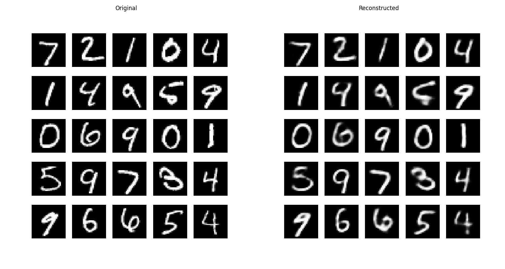
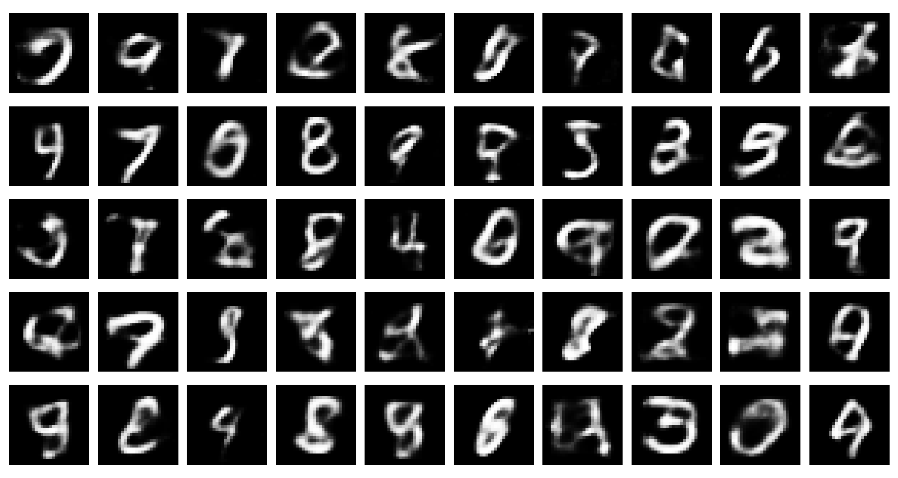
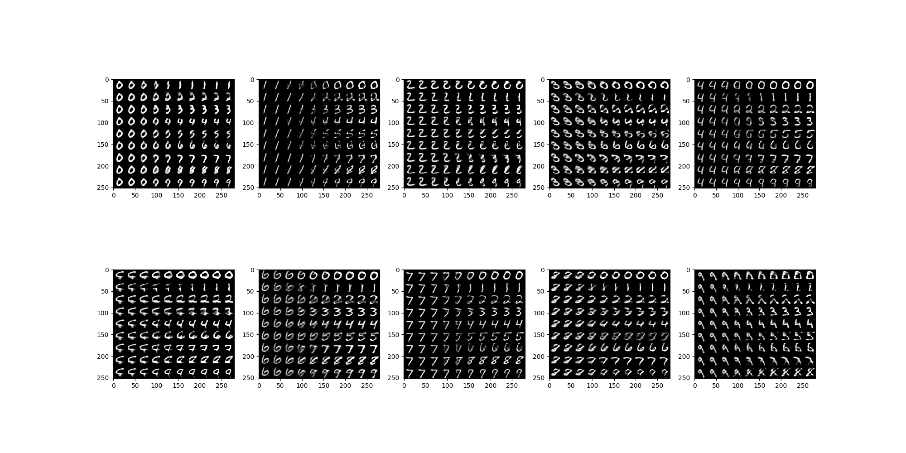
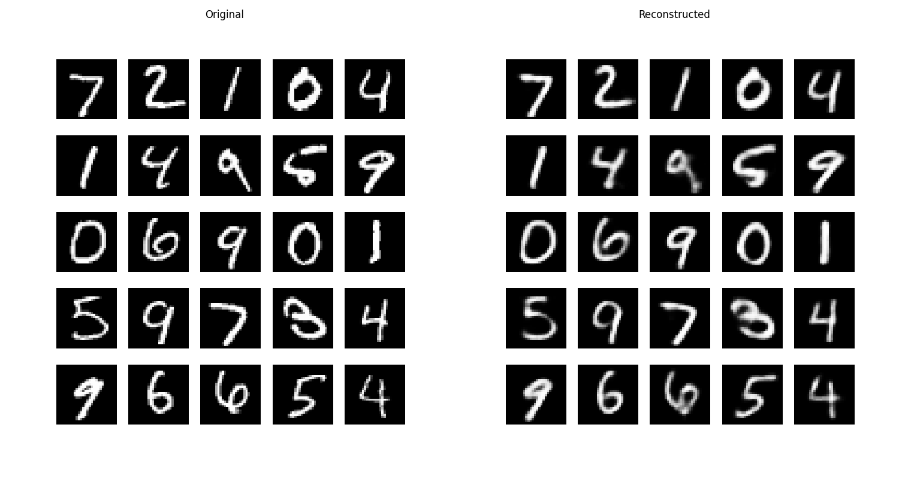
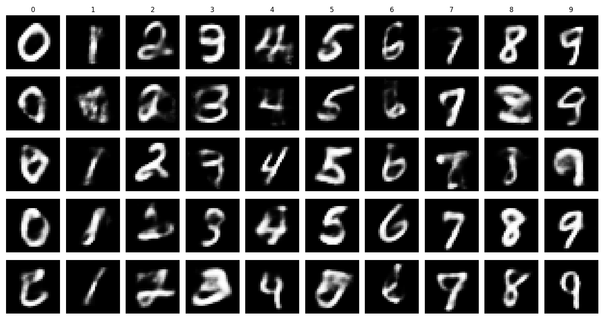
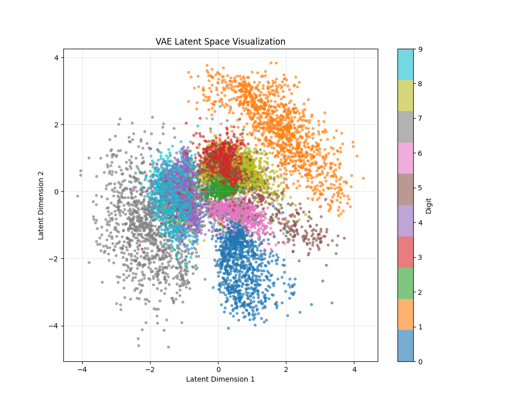
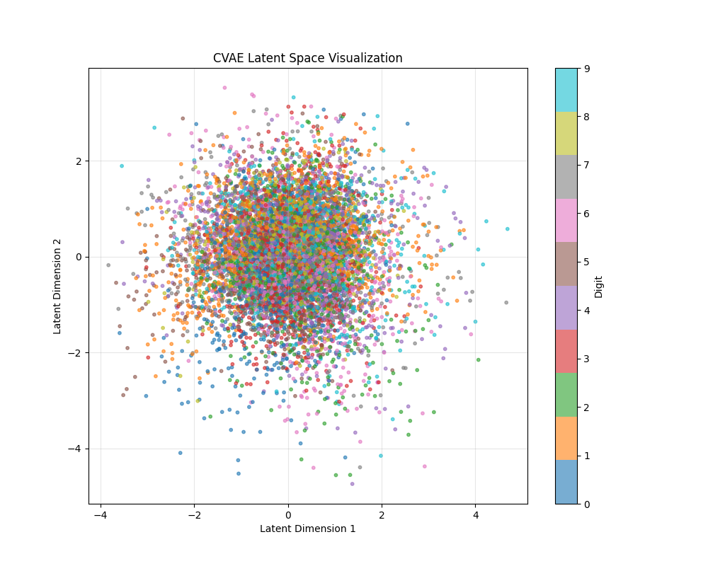

# vae-pytorch 

Implementation of VAE, cVAE. 

VAEs are nice since not only can we reconstruct stuff like AEs, but we can also generate data. 


| Figure 1 | Figure 2 |
|----------|----------|
|  |  | 
| VAE reconstruction of MNIST| Sampling in latent space from VAE | 

We can just linearly interpolate between two digits in the latent space and decode each point to get nice smooth transitions between digits.  



The problem with VAEs is that we can't actually *choose* which digit (e.g. 2) we want to sample. This is where CVAEs come in. We condition both the posterior on the class ($q(z|x)$ turns into $q(z|x, y)$). It can also reconstruct, but now, we can choose which digits to sample! 

| Figure 3 | Figure 4 |
|----------|----------|
|  |  | 
| CVAE reconstruction of MNIST| Sampling in latent space from CVAE | 

If we take a look at the latent embeddings of MNIST, you can see distinct clusters in VAE. However, in CVAE, we are conditioning the latent distribution on the class itself, so there is no need to separate them, and so they look like they overlap. 

| Figure 5 | Figure 6 |
|----------|----------|
|  |  | 
| Latent Embeddings of VAE | Latent Embeddings of CVAE |

Setup 
```
conda create -n vae-pytorch python=3.13
pip install torch torchvision numpy matplotlib
```

Both easy to implement. VAE implementation from ECE685 HW and cVAE from [here](https://github.com/unnir/cVAE), though I haven't actually ran it. 

## Implementation Details 

Nothing really, just works well out of the box. The CVAE was not as scary as I thought since conditioning was a simple as concatentating the feature tensor with the class tensor. 
